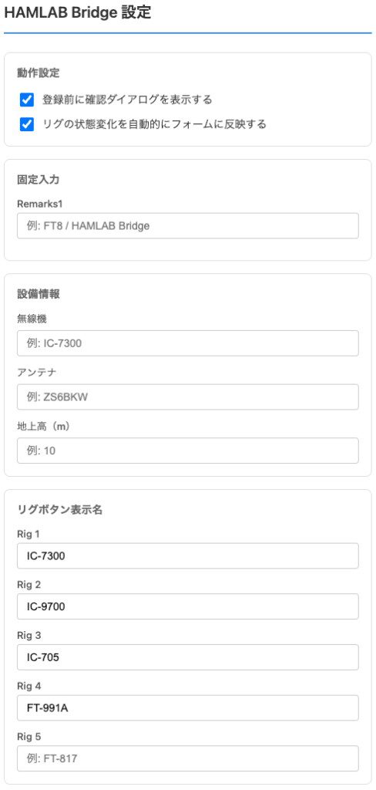

# HAMLAB Bridge

WSJT-X / JTDX から送信される ADIF データを [HAMLAB](https://hamlab.jp/) に自動入力するブラウザ拡張機能です。

## 機能

- ローカルの HAMLAB Bridge サーバーから WebSocket 経由で ADIF を受信
- HAMLAB のログ入力フォームに自動入力
  - コールサイン、日付、時刻、周波数、RST、モード、グリッドロケーター 等
- JCC/JCG、QTH、Grid（高精度）、オペレーター名の補完に対応
- 確認ダイアログの表示/非表示を選択可能
- 設備情報（無線機、アンテナ、地上高）の自動入力

## 対応ブラウザ

- Chrome / Edge などの Chromium 系ブラウザ
- Firefox

## 必要なもの

- HAMLAB Bridge サーバー（`ws://127.0.0.1:17800/ws` で待ち受け）
  - [udp-bridge](https://github.com/itcom/udp-bridge) - WSJT-X/JTDX からの UDP パケットを受信し、WebSocket で配信するサーバー
  - CAT/CI-V 連携にも対応（無線機の周波数・モード取得）

## インストール

### Chrome / Edge

#### リリース版

1. [Releases](../../releases) ページから最新の `hamlab-bridge-vX.X.X-chrome.zip` をダウンロード
2. zip を展開
3. Chrome で `chrome://extensions` を開く
4. 右上の「デベロッパーモード」を有効にする
5. 「パッケージ化されていない拡張機能を読み込む」をクリック
6. 展開した `chrome-mv3-prod` フォルダを選択

#### 開発版

```bash
yarn install
yarn dev
```

`build/chrome-mv3-dev` をブラウザの拡張機能ページで読み込んでください。

#### 本番ビルド

```bash
yarn build
```

`build/chrome-mv3-prod` が生成されます。

### Firefox

#### リリース版

1. [Releases](../../releases) ページから最新の `hamlab-bridge-vX.X.X-firefox.zip` をダウンロード
2. zip を展開
3. Firefox で `about:debugging#/runtime/this-firefox` を開く
4. 「一時的なアドオンを読み込む」をクリック
5. 展開したフォルダ内の `manifest.json` を選択

#### 開発版

```bash
yarn install
yarn dev:firefox
```

`build/firefox-mv2-dev` をFirefoxの拡張機能ページで読み込んでください。

#### 本番ビルド

```bash
yarn build:firefox
```

`build/firefox-mv2-prod` が生成されます。

## 設定

拡張機能のオプションページから以下を設定できます。

| 項目             | 説明                               |
| ---------------- | ---------------------------------- |
| 確認ダイアログ   | 登録前に確認ダイアログを表示するか |
| Remarks1         | 固定で入力する文言                 |
| 無線機           | 無線機名（例: IC-7300）            |
| アンテナ         | アンテナ名（例: ZS6BKW）           |
| 地上高           | アンテナ地上高（m）                |
| リグボタン表示名 | Rig 1〜5 のボタン表示名            |



## ライセンス

MIT
